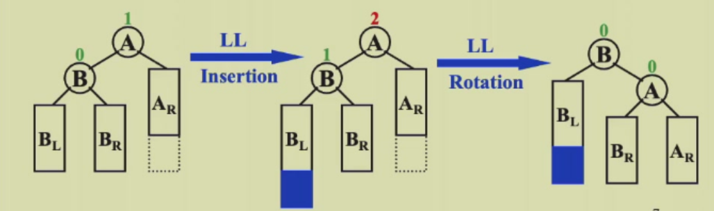
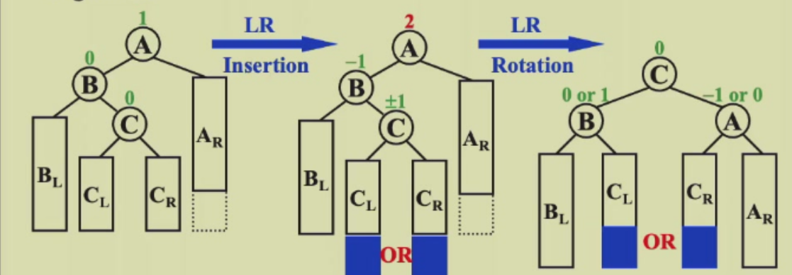
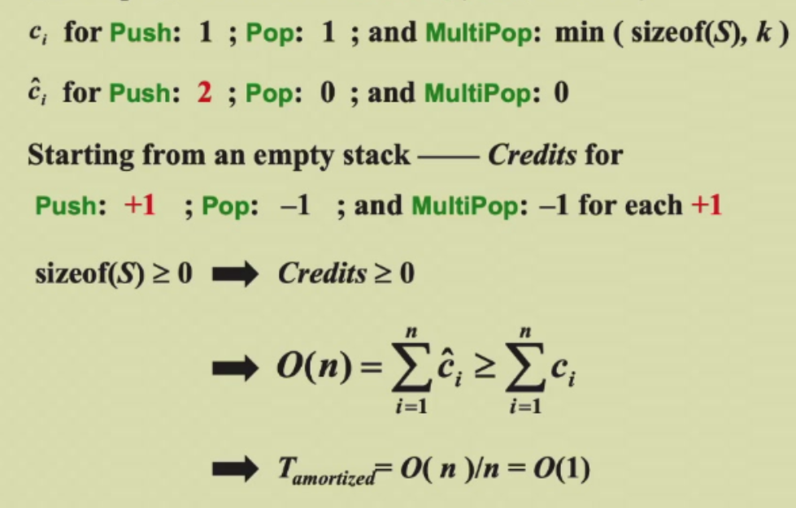
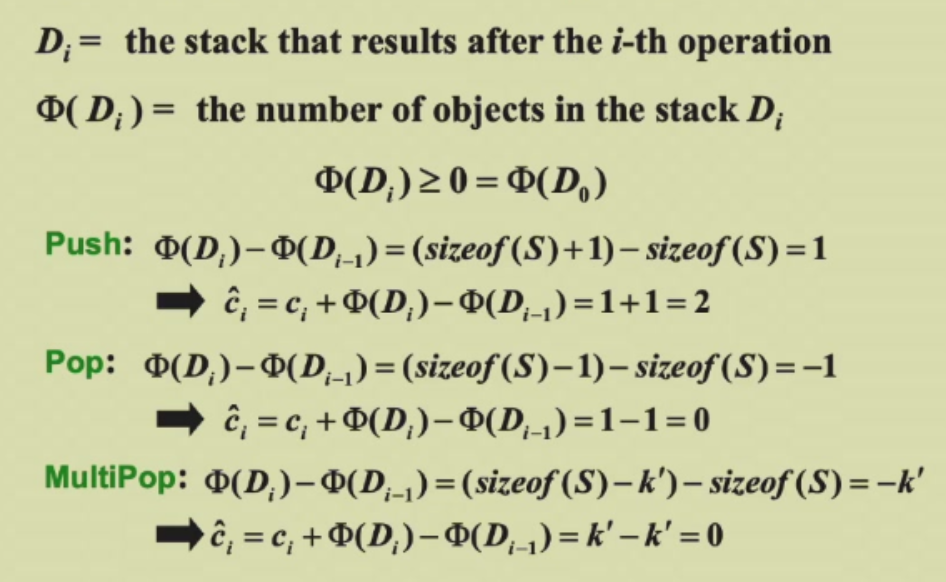
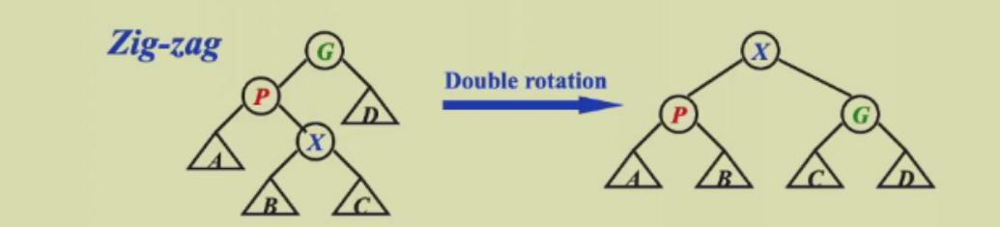
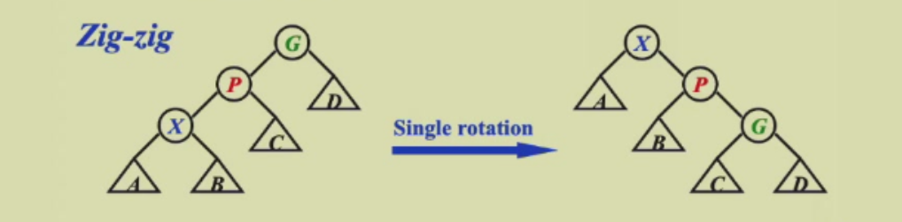
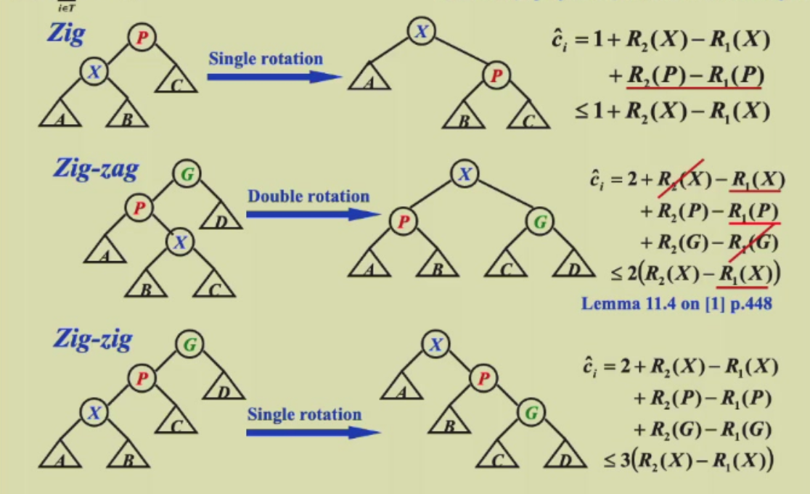

# week 1
## AVL tree

### 定义
设计avl tree的目的就是降低树的高度，从而使时间复杂度减低。

定义avl tree:

1. 对于每一个节点，他的左右子树都是平衡的；
2. 左右子树高度差绝对值不超过1；

height：定义空树的高度为-1，只有一个节点的树的高度为0，以此类推。

balance factor（平衡因子）：$BF(node)=h_L-h_R$ .

对于avl tree,BF=0，-1，1.
### 操作
**旋转：**

旋转需要O(1)的时间，旋转的目的是可以改变左右子树的高度差，使树更平衡。

旋转可以看作把某个节点“拎起来”，拎起来的那个节点的子树也会有相应的变化。

**插入：**

插入完元素后要恢复avl tree的性质，此时从下往上找到第一个BF不正常的节点，此时有两种情况：

1. RR/LL case:插入在右（左）儿子的右（左）子树上，此时进行一次旋转；

2. RL/LR case：插入在右（左）儿子的左（右）子树上，此时进行两次旋转；


可以发现，当节点在一条线上时，一次旋转就能调整好高度；当节点呈现锯齿状，要用两次旋转进行调整。

### 代码实现
avl tree的结构定义，这里使用高度来计算平衡因子，更好维护：

```c
typedef struct _node{
    int data;
    int height;
    struct _node* left;
    struct _node* right;
}avltree;

int get_height(avltree* t){
    if(t){
        return t->height;
    }else{
        return -1;
    }
}
```

插入的实现，先按照BST的插入方法进行递归，然后进行相应的旋转以维护avltree的性质：
```c
avltree* insert(avltree* t,int x){
    if(t){
        if(x<t->data){
            t->left=insert(t->left,x);
            if(get_height(t->left)-get_height(t->right)>=2){
                if(x<t->left->data){
                    t=LL(t);
                }else{
                    t=LR(t);
                }
            }
        }else if(x>t->data){
            t->right=insert(t->right,x);
            if(get_height(t->right)-get_height(t->left)>=2){
                if(x<t->right->data){
                    t=RL(t);   
                }else{
                    t=RR(t);
                }
            }
        }
    }else{
        t=(avltree*)malloc(sizeof(avltree));
        t->data=x;
        t->height=0;
        t->right=NULL;
        t->right=NULL;  
    }
    t->height=max(get_height(t->right),get_height(t->left))+1;
    return t;
}
```

四种旋转的实现，自己画图然后修改对应指针即可，注意高度的维护：
```c
avltree* LL(avltree* t){
    avltree* temp=t->left;
    t->left=temp->right;
    temp->right=t;
    t->height=max(get_height(t->right),get_height(t->left))+1;
    temp->height=max(get_height(temp->right),get_height(temp->right))+1;
    return temp;
}

avltree* RR(avltree* t){
    avltree* temp=t->right;
    t->right=temp->left;
    temp->left=t;
    t->height=max(get_height(t->right),get_height(t->left))+1;
    temp->height=max(get_height(temp->right),get_height(temp->right))+1;
    return temp;
}

avltree* LR(avltree* t){
    avltree* temp=t->left->right;
    t->left->right=temp->left;
    avltree* temp1=t->left;
    t->left=temp->right;
    temp->left=temp1;
    temp->right=t;
    t->height=max(get_height(t->right),get_height(t->left))+1;
    temp1->height=max(get_height(temp1->right),get_height(temp1->right))+1;
    temp->height=max(t->height,temp1->height)+1;
    return temp;
}

avltree* RL(avltree* t){
    avltree* temp=t->right->left;
    t->right->left=temp->right;
    avltree* temp1=t->right;
    t->right=temp->left;
    temp->right=temp1;
    temp->left=t;
    t->height=max(get_height(t->right),get_height(t->left))+1;
    temp1->height=max(get_height(temp1->right),get_height(temp1->right))+1;
    temp->height=max(t->height,temp1->height)+1;
    return temp;
}
```

### 时间复杂度
引论：存在某个常数c，使得 $n \geq c^h$.

证明：设一个高度为 h 的 avl tree 的节点的最少个数为N(h),那么他的左右子树高度分别为N(h-1),N(h-2),不难得出 $N(h)=N(h-1)+N(h-2)+1$.从而推出N(h)与斐波那契数列有关系：$N(h)=F_{h+3}-1$。得出c是与$\sqrt5+1 \over 2$有关的常数。

有引论推出，$h \leq \log_c n $,则有**h=O(logN)**.

## 摊还分析 Amortized Analysis
worst-case bound > amortized bound > average bound

摊还分析剔除掉了不可能的情况，最好从一个空的结构开始分析一连串操作的平均花费时间。

以栈操作为例子，有pop,push和multipush( 连续弹出k个，时间复杂度O(k) )三种操作。
### 聚合分析 Aggregate analysis
n次操作的最坏时间为T(n),那么 amortized cost = T(n)/n.

对于栈的例子，最坏情况是push n-1 次，然后multipush 一次。T(n)=2n-2=O(n),摊还复杂度为O(1).
### 核算法 Accounting method
核算法的思想在于取长补短，即我们可以把多出来的消耗存在Credits里，不够时再取出来用。记每一次的摊还成本为 $\widehat{c_i}$ ,actural cost为 $c_i$， 有：$$\widehat{c_i}=c_i+credits$$

**需要注意，我们需保证摊还成本比实际总花费大，即：**
$$\sum_{i=1}^{n}{\widehat{c_i}} \geq \sum_{i=1}^{n}{c_i}$$
或：
$$\sum_{i=1}^{n}credits \geq 0$$

例子：

### Potential method
由于核算法的均摊成本不一定好设计，所以我们定义第i次操作为$D_i$,有： $credits_i=f(D_i)-f(D_{i-1})$。

这样只要保证 $D_0$ 最小即可，一个技巧是让他等于0.

例子：


## Splay tree
Splay tree的想法是用更少的代价来实现高效的数据结构，他会将每一次查找到的节点移动到根节点上。他实现了：**从一个空树开始进行M次操作，那么总的时间复杂度不超过O(MlogN)**.

注意不是每次操作的时间复杂度都是O(logN),而是均摊下来的总时间复杂度为O(MlogN).

### 插入
用bst的方法进行插入，然后把刚刚插入的节点通过一系列旋转移动到根节点的位置。

定义刚插入的节点为x,父节点为P,父节点的父节点为G.

1. zig-zag(锯齿形):对x进行 double rotation，操作与LR/RL case完全相同;

2. zig-zig(一条线)：先提起P,在提起x;


如此反复操作，直到x到达根节点。

### 删除
1. 首先找到要删除的节点，用上述splay方法把他移动到根节点位置
2. 删除根节点，此时剩下左右两颗子树 $T_L$ , $T_R$ .
3. 找到左子树 $T_L$ 最大的节点，用上述splay方法把他移动到根节点位置，由于这是左子树最大的节点，所以得到的新树没有右子树。因此直接把原来的 $T_R$ 接到右边即可。

### 均摊分析
前置公式：若 $a+b\leq c $,则 $loga+logb\leq 2logc-2$

我们设置的幂函数为子树的点的数量的对数，由于子树点数量可能很多，所以取对数使其变小，更有利于估算出精确的上界。即R(i)=log S(i).其中rank约等于树高。

接下来分析splay tree查询的三种操作,通过放缩，把credit放缩到只与X这个节点有关。同时由于zig-zag和zig-zig可能会操作多次，所以放缩时必须消掉常数2（利用上面的公式）。还有一点技巧，如zig-zag中$R_1(G)=R_2(X)$:



其中zig-zag和zig-zig不知道会操作多少次，zig至多操作一次，我们都把他们放缩到 $3[R_2(x)-R_1(x)]$ .由于每次结束时的$R_2(x)$是下一次操作的$R_1(x)$，所以都会消掉，只剩下最后的 $\sum_{i=1}^{n}{\widehat{c_i}}=3[R_2(root)-R_1(leaf)]=O(logN)$ ,
