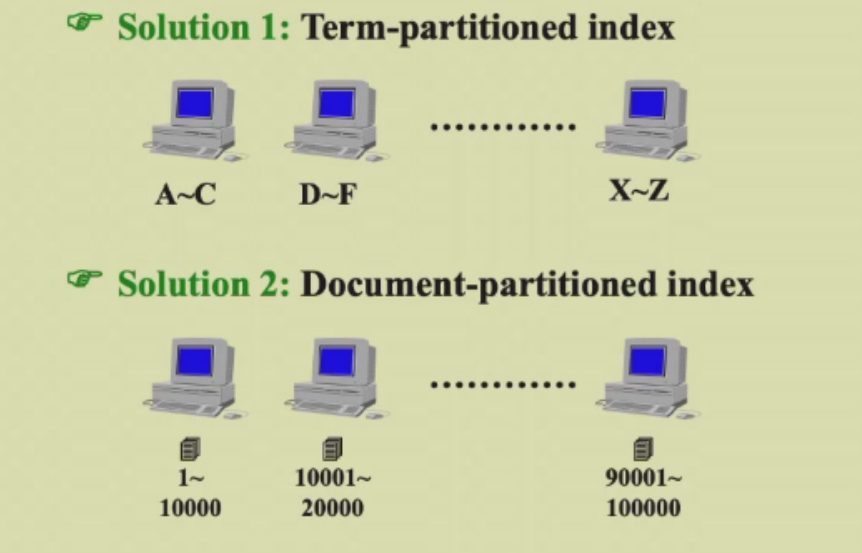

# week4
## 倒排索引（Inverted file index）
- 链表存储,保存单词在那些文档出现以及出现次数
- 当多个单词同时搜索时，从出现最少的词入手搜索会更快，因为出现多的词不能区分各个文档的区别

### 构建倒排索引
- 逐个读取构建，注意：
  - Word stemming(提取词语主干):如过去式，进行时等语法看作同一个单词
  - stop word：即去掉出现次数过多的词
- 读取有两种方式：
  - searching tree：如B+ tree
  - hashing
- 储存时内存不够，则储存进磁盘，磁盘可以有两种分布式储存方式：
    - 第一种方式效率更高，但出故障时影响较大，所以一般工程上用第二种方式

- dynamic indexing（插入，删除）
  - main index和auxiliary index
- 搜索引擎的评价:
  - 准确度(precision):准确率很高则可能返回的结果不包括所有的正确网页
  - 召回率(recall)：召回率很高则可能返回结果包含了所有正确网页，但也包含了很多错误网页
  