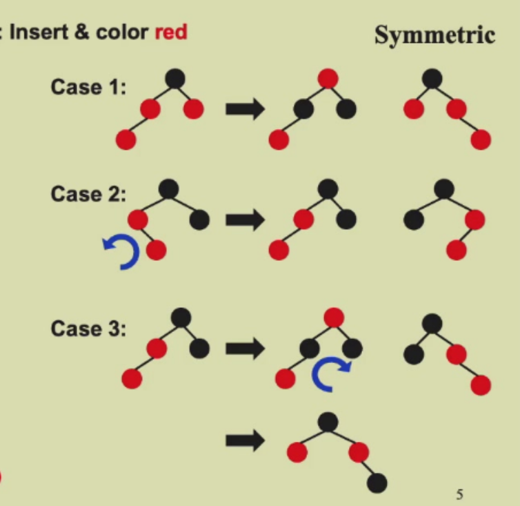
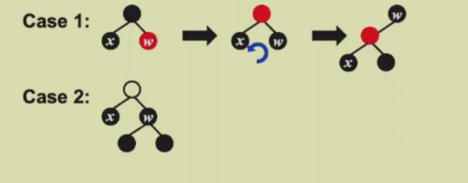
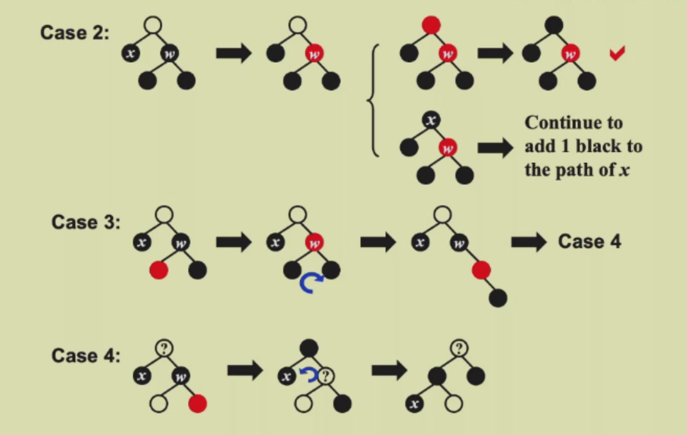

# week 2
## 红黑树
红黑树满足以下五条定义：

1. 所有节点非黑即红
2. 根节点时黑色的（保证树的表示唯一）
3. 每个NIL节点是黑色的
4. 如果一个节点是红色的，那么他的孩子节点是黑色的
5. 每一个节点，所有从他到叶子节点（NIL）的路径的黑色节点数量是相同的.定义黑高为这条路径上的黑色节点数量（不包含自己）

### 性质
**N个内部节点(即非NIL节点)的红黑树的高度最多是2log(N+1).**

先证对任意节点x，$N(x)\geq 2^{bh(x)}-1$

归纳法证明：h(x)=0时显然成立;

假设h(x)=k时成立，当h(x)=k+1时，bh(child)=bh(x) or bh(x)-1

由归纳假设：$N(child)\geq 2^{bh(child)}-1\geq 2^{bh(x)-1}-1$

则 $N(x)=N(child1)+N(child2)+1\geq 2^{bh(x)}-1$,得证引理.

又由 $h=bh+rh\leq 2*bh$ 得到：$N(x)\geq 2^{\frac{h(x)}{2}}-1$，证毕.

### insert
我们按照BST的方法插入，并把颜色设置为红色，这样可以不破坏性质5，现在我们要来维护性质4，如果父亲节点是红色的，那么肯定要把他变黑，所以又要维护性质5.

**先看叔叔节点**，如果叔叔节点是红色的，直接改变父亲，叔叔和爷爷节点颜色即可(此时把问题推给祖父节点)；

**如果叔叔节点为黑色，再看叔叔的侄子节点**，如果是近侄子节点，那么旋转成远侄子；接下来改变相应颜色旋转即可。

一个想法是，哪边的黑多了，就通过旋转（把这条边提起来）来平衡黑高。

### delete
通过BST的删除方法可以知道，我们删除的对象永远是**叶子**节点。如果删除的是红色节点，显然不会有任何影响。

若删除的是黑色节点，那么黑高要减小，我们肯定要增加黑色节点，不妨增加黑色到待删除节点X上（这样操作具有唯一性），把x节点变成双黑节点，然后通过变化消除双黑，最后再删除X.

**先看兄弟节点**，若兄弟为红，要先转化成为黑的情况。

**再看侄子节点**,侄子都是黑色则很好解决；若侄子不为黑色，先看远侄子，把远侄子转化为红色。

## B+树
M阶的B+树满足：

1. 根节点是叶子或者**有2到M个孩子节点**
2. 非叶子的节点（除根）都有$\lceil M/2\rceil$到M个孩子节点
3. 所有叶子节点在同一层
4. 所有键值存在叶子里，每个叶子包含$\lceil M/2\rceil$到M个数据
5. 一个节点里有$e_1,e_2,...e_k$个，那么他们就是子树$T_2,T_3,...T_{k+1}$中存储的键值的最小值
6. 叶子节点储存的键值大小是单调递增的

### 插入
1. 找到对应位置插入
2. 如果叶子节点个数超过了M，先看同一个父亲节点得兄弟节点有没有空位，如果有，就把多出的节点推过去；如果兄弟节点都满了，就分裂成两个节点
3. 注意更新各个节点的导航

### 删除
与插入类似

### 时间复杂度
每个节点最少有$\lceil M/2\rceil$个孩子，那么树最坏高度$h=\log_{\lceil M/2\rceil}N$.则T(find)=O(h)=O(logN).