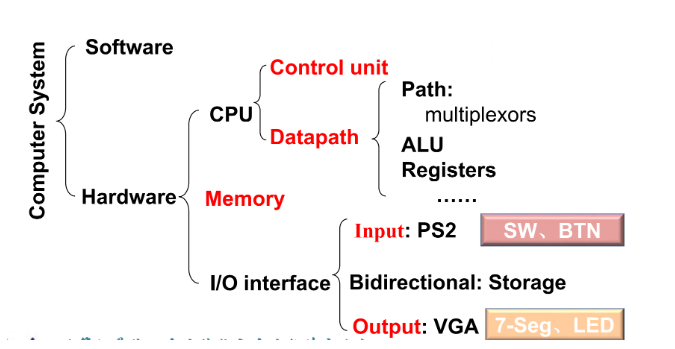

# introduction

## 重要思想
- 摩尔定律
- 抽象（如ISA）
- 加速大概率事件
- 并行
- 流水线
- 预测
- 存储器层次
- 冗余提高可靠性
## 软件
- systems software:aimed at programmers
- applications software: aimed at users
- operating systems
- complier
- firmware(驱动)

高级语言经过**编译**生成汇编语言，汇编语言经过**汇编**生成二进制机器指令。
## 硬件
### 冯诺依曼架构
- 由I/O设备，数据通路，控制器，储存器组成

### 存储器层次
由顶端到底端：快，贵，小->慢，便宜，大:

缓存/cach ~ SRAM

主存/内存 ~ DRAM (易失性存储器)

辅存/外存/二级储存器 ~ 闪存（flash），磁盘(非易失性储存器)

只有放入内存的程序才能被cpu执行，cache也在cpu中

## 指令集体系架构
- RISC（reduced instruction set computer）:MIPS，ARM等
- CISC（complex instruction set computer）：x86等

**ISA联系了硬件和软件**

## 生产
集成电路（Integrated Circuit）
## 计算机性能
- 执行时间（execution time）:一个任务从开始到完成的时间
- 吞吐量（throughput）：单位时间内完成的任务数量
- x is n times faster than y:$performance_x/performance_y=execution\_time_y/execution\_ time_x$

**重要公式：**

$时钟周期长（clock\ period）=1/时钟周期频率（clock\  rate）$

$cpu执行时间(CPU\ time)=指令数（IC）*每条指令的平均周期数（CPI）*时钟周期长$

$MIPS=IC/(CPU\ time * 10^6)$

**影响因素：**

- Algorithm: affects IC, possibly CPI
- Programming language: affects IC, CPI
- Compiler: affects IC, CPI
- Instruction set architecture

## 功耗
$P=(C*U^2*f)/2$

**Amdahl's law:**

$T_{improved}=\dfrac{T_{affected}}{improvement\ factor}+T_{unaffected}$.

SPEC基准测试:测试CPU性能。