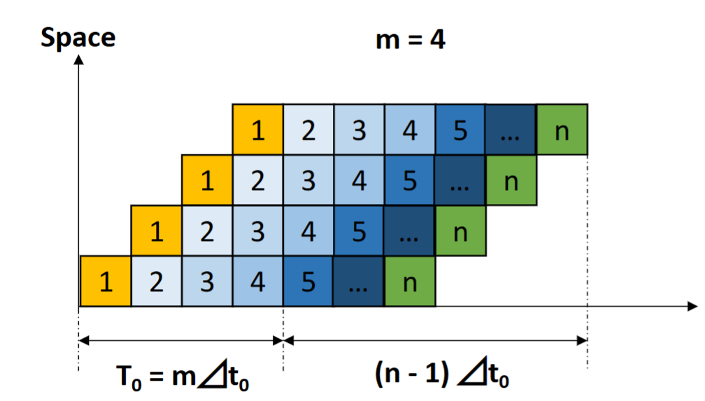
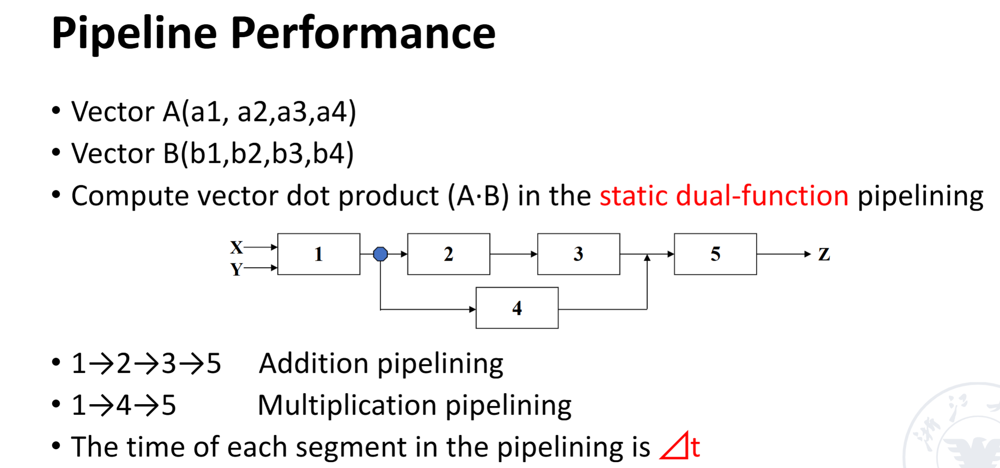
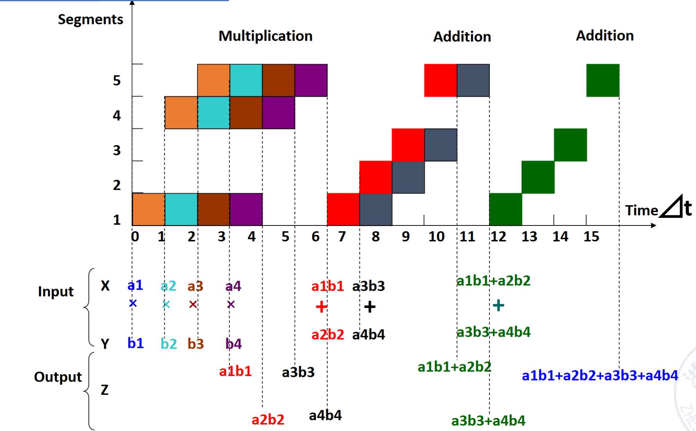
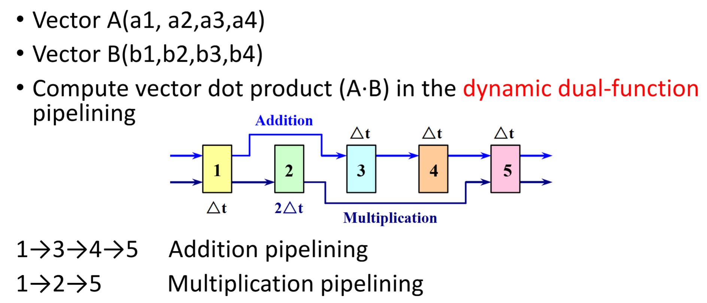
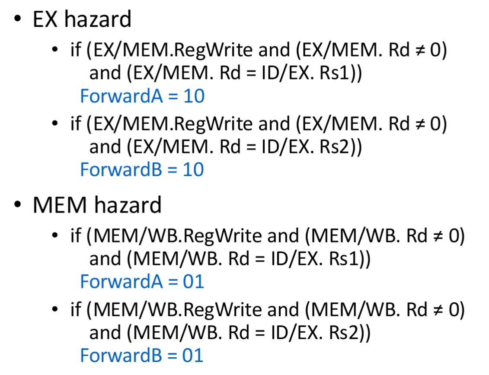
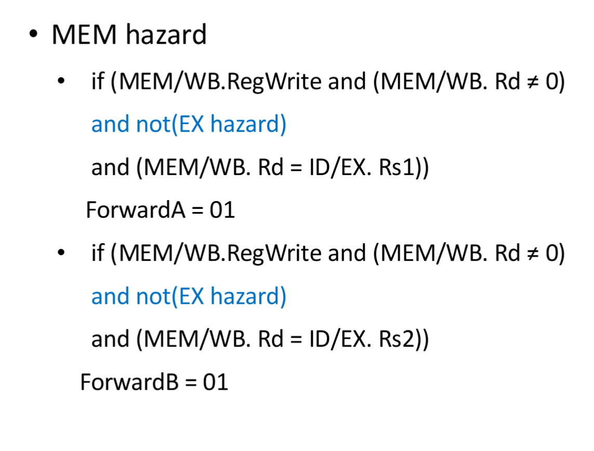
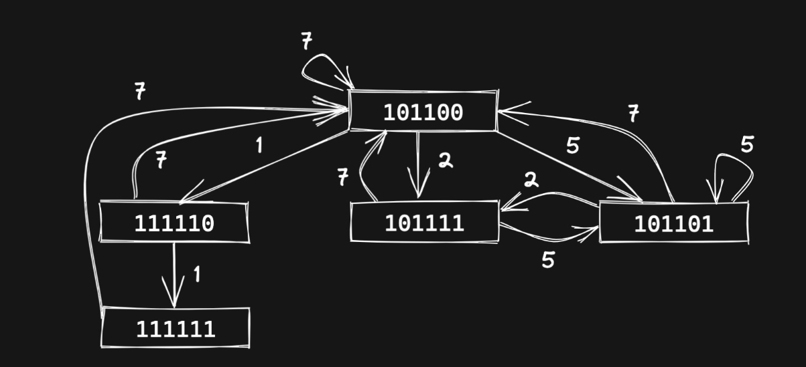
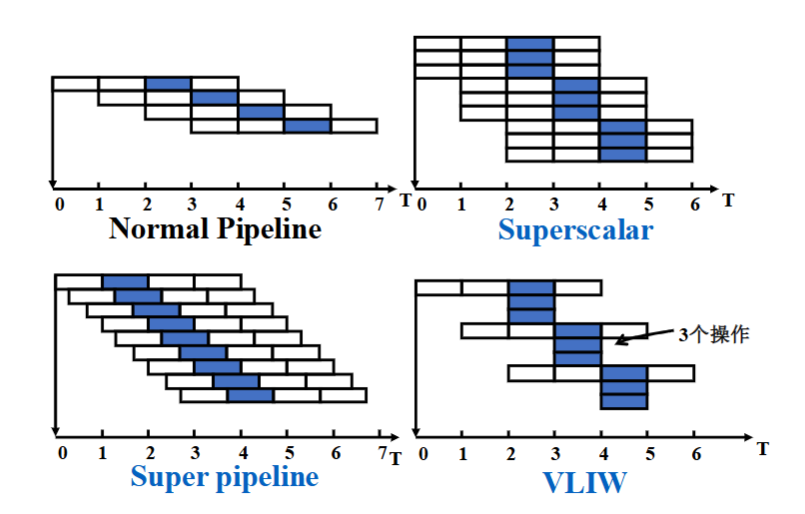

# processor

1. fetch the instruction from the memory
2. decode and read the registers
3. next steps depend on the instruction class
   - memory-reference
   - arithmetic-logical
   - branches
4. alu to calulate
   - arithmetic result
   - memory address for load/store
   - branch comparison

## datapath
r:取出寄存器中rs1,rs2中的值进入alu计算，得到的结果写回寄存器（rd）

i（load）:从寄存器中取出rs1的值,与立即数进入alu相加，得到地址，从data memory中取出该值并写回寄存器（rd）

s:与i型指令类似的方法得到地址：rs1与立即数相加；并把rs2的值写入该data memory的该地址 

sb（eg: beq a1,a2,200）:取出rs1,rs2的值进入alu进行比较,由比较结果决定是pc+4还是pc+立即数（sb指令中的立即数是相对pc的地址）

j:jump指令显示在对pc的转变上面，跳转到pc+立即数的地址

## controller

## ISA设计
显示操作数：寄存器，内存，立即数

- 栈结构：栈顶指针是第二操作数，栈顶指针下面的是第一操作数（注意sub）
- 累加器结构:第一源操作数是寄存器，第二是内存
- 通用寄存器结构（GPR）
  - register-memory architecture：所有指令都可以访问memory
  - load-store architecture：只有load/store指令可以访问memory

多用GPR架构，因为寄存器访问速度更快（比缓存都快），并且寄存器方便临时变量的储存

### 寻址
字节为基本单元

小端序：低位放在地址的低位
大端序：高位放在地址的低位
#### address alignment（字节对齐）
当 **地址 mod 数据长度 = 0** 时，则是对齐的

如果不对齐，则需要多次才能读出想要的数据。比如要读4字节数据，那么内存是从0，4，8等地址开始读取，不能从1，2，3等地址开始读，所以要字节对齐

## Pipelined 
这是一种重叠执行（ overlapping execution ） ，相比于顺序执行（ sequential execution），对各模块的利用率更高，当同时硬件结构也更复杂，开销更大。

Each subprocess and its functional components in the pipelining are called **stages** or **segments**,the number of segment are called the *depth* of pipelining.

- pass time :从第一个任务进入开始到完全进入（最多重叠的时候）
- empty time：最后一个任务从进入到出来（与pass time相对）
### 分类
按功能分：

- single function pipelining：只能执行一种功能的指令（如浮点指令集）
- multi function pipelining：可以执行多种指令功能
  - static pipelining：一次只能执行一种类型的指令
  - dynamic pipelining：一次可以同时执行多种类型的指令

按线性性分：

- linear pipelining：流水线的每一阶段的执行是不可逆的
- nonlinear pipelining：执行到流水线的某一阶段后也可以回到之前的阶段

按有序性分:

- ordered pipelining：inflow顺序和outflow顺序一样
- disordered pipelining：outflow的顺序和inflow不同

### 吞吐量，加速比，效率
- 单周期的时钟周期：最长的一条指令的执行时间
- 流水线时钟周期：阶段的最长时间

重要参数：

- n:表示指令条数
- m:表示一条指令分几个阶段执行 

**吞吐量（Throughput）：$Tp=\frac{n}{T}$**

其中n是指令的数量，T是执行总时间，吞吐量表示单位时间执行的指令的条数。

$$Tp\leq Tp_{max}=\lim\limits_{n\to\infty}Tp$$

对于一般的流水线指令，$Tp=\frac{n}{(m+n-1)t_0},Tp_{max}=\frac{1}{t_0}$.

**加速比（Speedup）：$Sp=\frac{Extime_{single \  cycle} }{Extime_{pipelining}}$**

一般流水线：$Sp=\frac{n*m*t_0}{(n+m-1)t_0}=\frac{n*m}{n+m-1}$

**效率比（Efficiency）：$ρ=\frac{n*m*t_0}{(n+m-1)*m*t_0}=\frac{n}{n+m-1}$**

效率的含义就是即考虑时间消耗又考虑空间消耗，**在时空图上，体现在画出的格子占总格子的比例.**

在加速比和效率比中，如果$n\to+\infty,则Sp=m,ρ=1$，说明当指令非常多，填满流水时效率最高。

#### 静态流水线例子

注意是静态流水线，所以要等乘法执行完之后才能执行加法；同时，加法操作也要先等之前的结果计算出来之后才能开始执行：

画出图易得：$T=15t_0$，再依图计算即可。

#### 动态流水线例子

乘法和加法可以同时执行，不过仍然要注意，如果需要之前的结果，那么必须等到之前的指令执行完毕才可以开始执行。

### 实现
1. IF:instruction fetch from memory
2. ID:Instruction decode and register read
3. EX:EXecute operation or calculate address
4. MEM:Access memory oprand
5. WB:write result back to register

reg占半个时钟周期，前半个写，后半个读

### hazard 竞争
通用的解决方法是暂停（stall），添加气泡(addi x0,x0,0)。但是这会导致效率下降很多。
#### structure hazard
- 定义：a required resource is busy
- 添加硬件来解决，比如把data memory和instruction memory分开 
#### data hazard
- 定义：该指令需要的数据要等到上一指令完成后写回

- 解决：

1. forwarding——adding extra hardware to retrieve the missing item early from the internal resources
   - 比如把上一条指令EX阶段或MEM阶段得到的数据提前传递给下一指令的EX阶段
2. 部分情况也可以由编译器解决，如调整指令执行的顺序

##### forwarding
简单情况：

double data hazard：

load-use hazard:
#### control hazard
- 定义：flow of execution depends on previous instruction
- 解决：提前**预测**下条指令是pc+4还是跳转指令，如果预测错误则有惩罚（把预测的结果置0，添加正确的跳转指令）
  - 简单预测（如预测pc+4）
  - 根据经验（如预测循环结束跳转）
  - 动态预测（根据之前的结果推断）
  - 延迟决策（Delayed Decision）：将 branch 前的无关指令移动到 branch 之后的 bubble 处（分支延迟槽）执行，减少为了等待而插入的无意义 bubble 代码

### 非线性流水线的调度
1. 首先通过预约表（Reservation table）来确定禁止集（prohibit sets）。禁止集即为过多少周期一定会出现冲突。
2. 再根据禁止集决定冲突向量（conflict vector）。冲突向量把禁止集中有的元素置1，其他位置0.
3. 由冲突向量画出状态转移图（state transition graph），从而算出所有调度
4. 最后算出最佳的调度

**例子：**

||1|2|3|4|5|6|7|
|-|-|-|-|-|-|-|-|
|$s_1$|x|||x|||x|
|$s_2$||x|||x|||
|$s_3$||x||||x||
|$s_4$|||x|||||

1. 首先算出禁止集={3,4,6},冲突向量=0101100
2. 接着用移位或的方法算出所有可能的冲突向量。比如第一位为0，那么就可以选择移动一位，即0010110（右移一位）| 0101100（新送进来的指令）=0111110（更新后的冲突向量）。
3. 接下来画出状态转移图，即把所有可能的冲突向量画进状态图里。然后找出所有构成的循环即为可能的调度:

4. 最后算出最佳调度。比如{1，1，7}的调度，平均调度时间=$\frac{1+1+7}{3}=3$,结果如下：

|调度方案|平均调度时间|
|-|-|
|7|7|
|1，7|4|
|1，1，7|3|
|2，7|4.5|
|2，5|3.5|
|2，5，7|4.67|
|5|5|
|5，2|3.5|
|5，7|6|

### 多发射
- static multiple issue
  - **compiler** groups instruction to be issued together
  - packages them into issue slots
  - compiler detects and avoid hazard
- dynamic multiple issue
  - **cpu** examines instruction stream and chooses instruction to issue each cycle
  - compiler can help by reordering instructions
  - cpu resolves hazards using advanced techniques at runtime

**speculation(猜测)**

- start operation as soon as possible
- predict;if not,roll-back
- examples:branch outcome,load

#### superscalar 超标量
- The number of instructions which are issued in ezch clock cycle is **not fixed**.
- if the upper limit is n,then the processor is called n-issue.
- 一次性打包发送多条指令
- it can be static or dynamic

#### VLIM(very long instruction word) 超长指令字

- The number of instructions which are issued in each clock cycle is **fixeds**.And these instructions constitute a long instruction
- 把几条指令拼接成一条长指令发送出去
- instruction scheduling is done **statically** by the compiler

#### super-pipeline
把流水线阶段做进一步的划分，但时钟周期没有缩短。即在一个时钟周期，指令不是同时发送出去的，而是把这个时钟周期分为n个阶段，每1/n的时间发送一条指令

