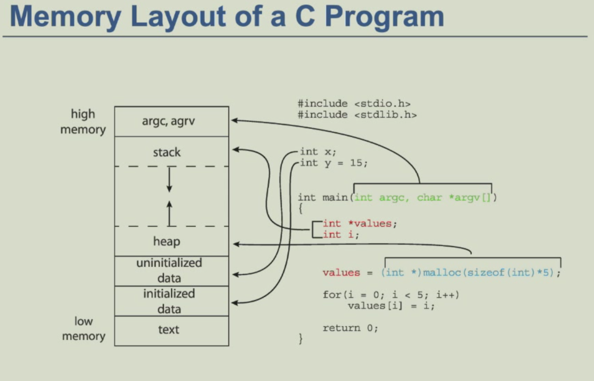
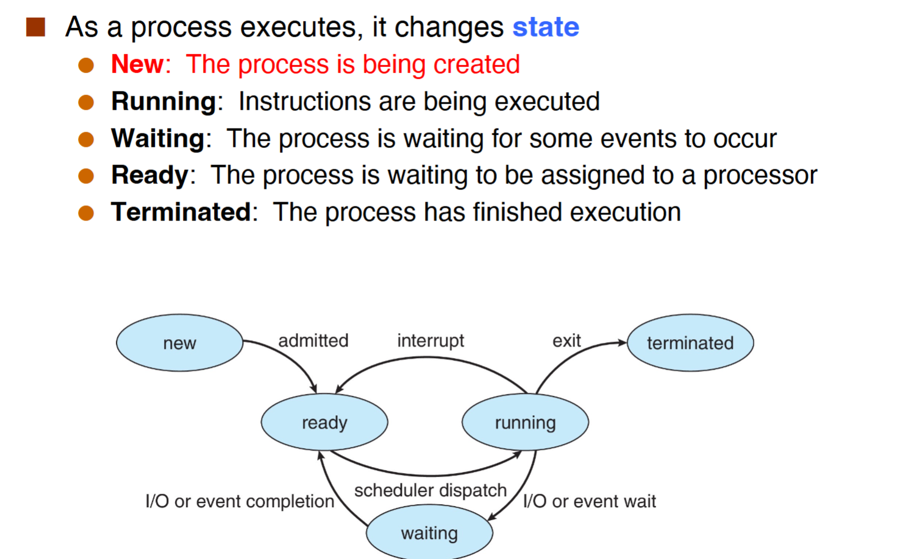
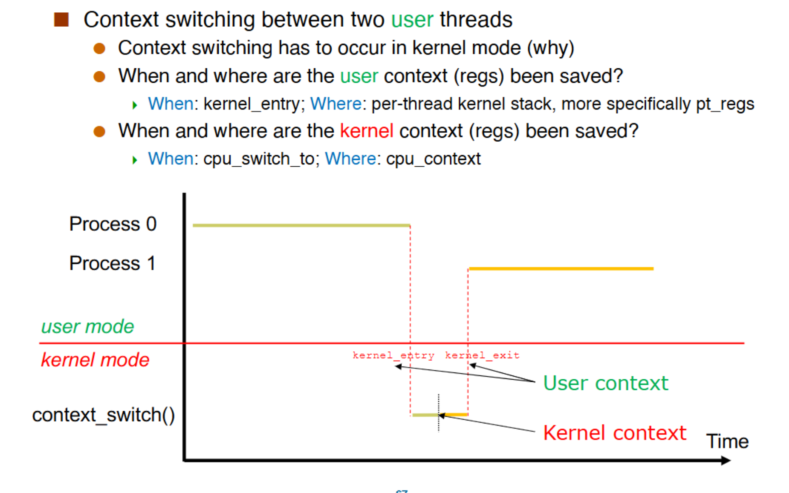

# processes(进程)
- process is **a unit of resource allocation and protection**.And it is a program in execution.
  - 进程是分配，线程是执行
- process=code(text),data section(global variables),program counter,stack,heap；具体如图：



（注意栈是由高到低的；data和text段是ELF的映射）

对于同一个程序，如果运行两次，产生的2个进程中，stack，heap的大小和内容是不一样的（因为两个程序可能正在调用不同函数等），data段的大小一样但内容不一样（可能不同变量的值被修改），text段的大小，内容一样

## PCB
- process control block(PCB):information associated with each process
- 每一个进程只有一个PCB，在new阶段分配PCB，在termination阶段free PCB.
- PCB储存了process number(pid),program counter,registers,process state,memory management等信息

## Process State(重点)



### new阶段
核心是两个syscall:folk和execv.

#### fork()
fork会创造一个新的进程。每个子进程只有一个父进程，并且他会有一个新的pid。子进程的内容是父进程的复制，并且所有的resource初始化为0

fork有两个返回值，**fork会把子进程的pid返回给父进程，把0返回给子进程**。另外，通过`getpid()`可以得到自己的pid，通过`getppid()`得到父进程的pid。

```c
pid=fork();
if(pid==0){
    printf("这是子进程");
}else if(pid>0){
    printf("这是父进程");
}
```

注意，在fork()调用完成后，每个进程将会继续执行后续的语句，且每个进程内的变量互不干扰。

**例子一：**

```c
pid1=fork();
printf("hello");
pid2=fork();
printf("hello");
```

第一次fork，进程由1个变成2个，然后输出两个hello；第二次fork，进程由2个变4个，然后输出4个hello。总共输出6个hello。

**例子二：**

```c
fork();
if(fork()){
    fork();
}
fork();
```

第一次fork，进程由1个变2个，if判断条件的fork使进程由2变4，**if语句内的fork只会对父进程执行**，即2个父进程进行fork产生2个新进程。此时共有6个进程，最后执行的fork使进程由6到12个，最终一共产生12个进程。

**pros and cons:**fork的优点是简洁，不需调用复杂参数，保持进程与进程之间的联系；缺点是性能差且有安全性问题

#### execv()
execv会用新的进程映像来替代当前进程，此时**当前进程会被清空**。

```c
int main(int argc,char* argv[]){
    pid_t pid=fork();
    if(pid==0){
        printf("1");
        execv("./callee",argc);
        printf("2");
    }else if(pid>0){
        printf("3");
    }
}
```

在上面的例子中，父进程会正确执行并输出“3”。但是execv的执行会**清空子进程**并进入“callee”进程，此时子进程已经被清空，所以只会输出“1”，不会输出“2”.

### Terminations 阶段
进程可以通过`exit()`这个system call来终止。终止后该进程的resource会被OS重新分配。

一个进程也可以去终止其他进程：使用signals和kill()这个system call。

注意SIGKILL,SIGSTOP这两个signals不能被handle（出于安全的考虑）

#### wait() and waitpid()
- wait()
  - block until any child complete
  - returns the pid of the completed child and the child's exit code
- waitpid()
  - block until a specific child complete


#### zombie
当子进程终止时，有些东西没有被deallocated(释放)。其中stack,heap是被清空的，CPU不占用；但是PCB等未被清空，内存仍然占用。

为了避免出现zombie，需要parent调用wait()

#### Orphans（孤儿）
- an orphan process is one whose parent has died
- the orphan is "adopted" by the process with pid 1
- Therefore，a orphan never become zombie

### ready,running,wait
通过scheduling queues（数据结构是链表）来维护。分为ready queue和wait queues。wait queues有多个是因为wait target（比如I/O,disk等）有多个。

#### context switch
- 这里的context就是指寄存器
- 当CPU从一个进程转换为另一个进程时，context switch就会发生
- context switch做的是储存旧的进程，然后载入新的进程
- Context of a process represented in the PCB

##### 汇编代码例子，
P0进程调用函数，储存P0，然后返回P1：

x0拿到prev的进程，x1拿到next的进程。x10是基地址。

栈的切换:`mov x9,sp`,储存P0进程的sp;`mov sp,x9`，拿回P1进程的sp;

储存P0:`stp x19.x20,[x8],#16`等，存储P0；

`add x8,x1,x10`切换到P1;

`ldp x19,x20,[x8],#16`等，存储P1;

代码的切换:`str lr,[x8]`和`ldr lr,[x8]`，然后通过**ret**切换。

##### Context Switch Scenarios
- kernel mode：
  - when:cpu_switch_to
  - where:cpu_context
- user mode:先通过kernel_entry进入kernel mode

